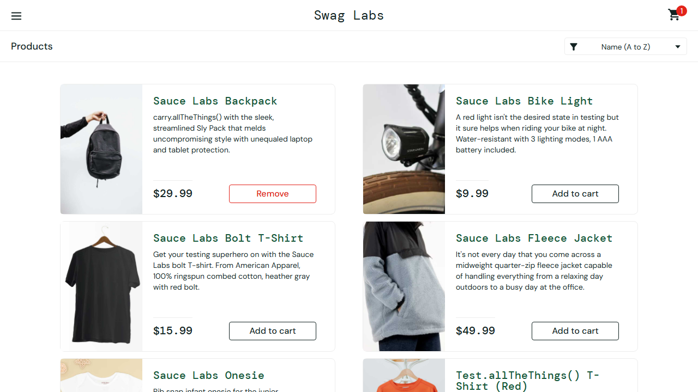

# DR-001 — Reporte de Defecto

| Campo | Valor |
|---|---|
| **ID** | DR-001 |
| **Reportado por** | Brayan Josué Corado Robles — Carné 1790-22-11094 |
| **Fecha de reporte** | 11 de septiembre de 2026 |
| **Módulo / Componente** | Carrito de compras — contador (badge) del ícono del carrito |
| **Severidad** | Media |
| **Prioridad** | Media |
| **Estado** | Cerrado — defecto simulado, no reproducible en el sistema real |
| **Tipo** | Funcional (Adecuación funcional — ISO/IEC 25010) |

---

## Título

El contador del carrito muestra "1" en lugar de "2" después de agregar un producto al carrito.

## Ambiente de pruebas

| Elemento | Detalle |
|---|---|
| Aplicación bajo prueba | https://www.saucedemo.com |
| Navegador | Chromium (Desktop Chrome) — modo headless |
| Sistema operativo | Windows |
| Framework | Playwright con TypeScript |
| Archivo de prueba | `tests/clase07.spec.ts` (línea 77) |
| Caso de prueba | "Comparar estados antes y después de una acción" |

## Precondiciones

- El usuario `standard_user` existe y está habilitado.
- El carrito se encuentra vacío al iniciar la sesión.

## Pasos para reproducir

1. Navegar a https://www.saucedemo.com
2. Iniciar sesión con el usuario `standard_user` y la contraseña `secret_sauce`.
3. Verificar que la URL corresponde a la página de inventario.
4. Confirmar que el badge del carrito no está visible (carrito vacío).
5. Hacer clic en el botón "Add to cart" del primer producto del listado.
6. Observar el valor numérico del badge del ícono del carrito.

## Resultado esperado

El badge del carrito muestra el texto **"2"**.

## Resultado obtenido

El badge del carrito muestra el texto **"1"**.

```
Error: expect(locator).toHaveText(expected) failed

Locator: locator('.shopping_cart_badge')
Expected string: "2"
Received string: "1"
Timeout: 5000ms

Call log:
  - Expect "toHaveText" with timeout 5000ms
  - waiting for locator('.shopping_cart_badge')
  14 x locator resolved to <span class="shopping_cart_badge" data-test="shopping-cart-badge">1</span>
     - unexpected value "1"

  at C:\Users\brayn\Desktop\DOCS DEV\prueba_qa\tests\clase07.spec.ts:77:37
```

El test se ejecutó dos veces por la configuración `retries: 1` y falló en ambos intentos (Run 6.8s y Retry #1 7.2s), lo que confirma que el fallo es determinista y no intermitente.

## Evidencia

Generada automáticamente por Playwright con `screenshot: 'on'`, `video: 'on'` y `trace: 'on'` en `playwright.config.ts`:

- **Screenshot del fallo (incluido en el repositorio):** [`evidencias/clase07/DR-001-fallo-badge.png`](../evidencias/clase07/DR-001-fallo-badge.png) — captura el momento exacto en que la aserción falla, con el badge visible mostrando "1".
- **Screenshots del caso de prueba:** [`clase07-estado-antes.png`](../evidencias/clase07-estado-antes.png) y [`clase07-estado-despues.png`](../evidencias/clase07-estado-despues.png) — estado del carrito antes y después de la acción.
- **Video de la ejecución:** `test-results/clase07-Clase-07---Evidenc-bb408-tes-y-después-de-una-acción-chromium/video.webm` — muestra el recorrido completo: login, carga del inventario, clic en "Add to cart" y aparición del badge.
- **Traza:** `test-results/clase07-Clase-07---Evidenc-bb408-tes-y-después-de-una-acción-chromium/trace.zip` — permite revisar paso a paso la línea de tiempo, las peticiones de red y los logs de consola.

### Captura del fallo



Para abrir la traza:

```powershell
npx playwright show-trace "test-results\clase07-Clase-07---Evidenc-bb408-tes-y-después-de-una-acción-chromium\trace.zip"
```

> Nota: la carpeta `test-results/` se regenera en cada ejecución y está excluida del control de versiones, por lo que el screenshot del fallo fue copiado a `evidencias/clase07/` para que quede disponible en el repositorio.
## Análisis (error / defecto / fallo)

- **Error:** modificación intencional del valor esperado en la aserción del caso de prueba, de `'1'` a `'2'`.
- **Defecto:** la línea `await expect(badgeDespues).toHaveText('2');` queda en el código de prueba con un valor esperado que no corresponde al comportamiento real del sistema.
- **Fallo:** al ejecutar la suite, el test falla y Playwright reporta la diferencia entre el valor esperado y el obtenido, junto con el elemento del DOM que resolvió el locator.

## Observaciones

Este defecto fue **simulado deliberadamente** como parte del Laboratorio 07, con el fin de generar y analizar la evidencia automática de un fallo. El comportamiento de la aplicación es correcto: agregar un solo producto debe reflejar "1" en el badge. El valor esperado fue revertido a `'1'` y la suite completa vuelve a ejecutarse sin fallos, por lo que el defecto no existe en el sistema bajo prueba.